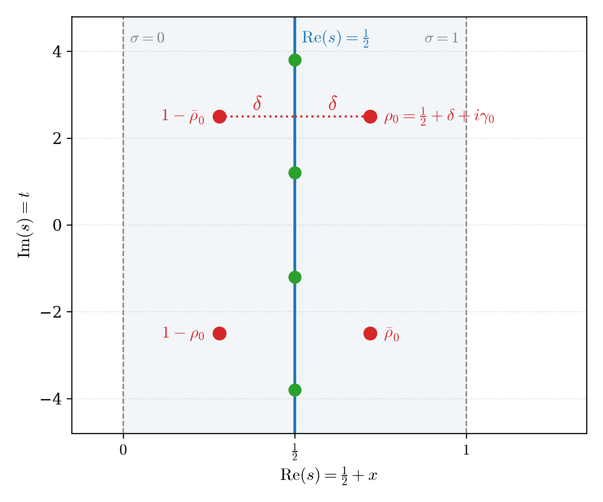
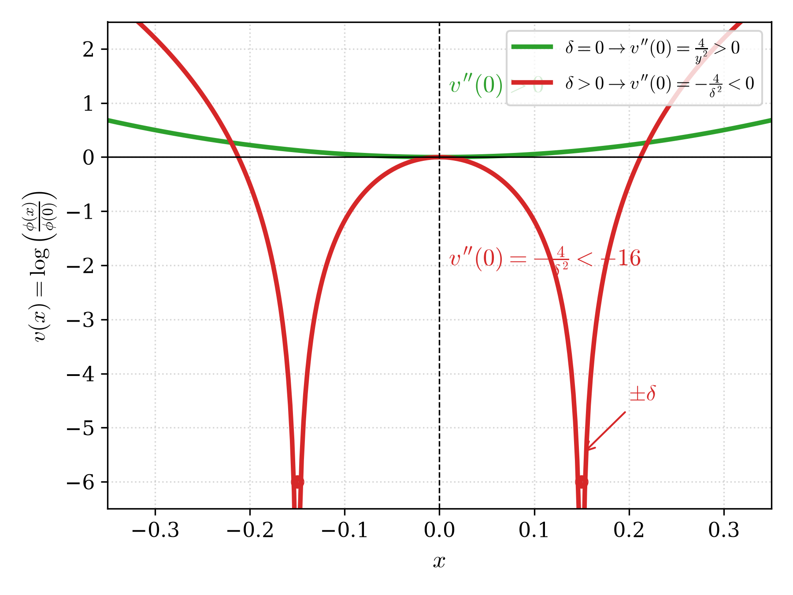
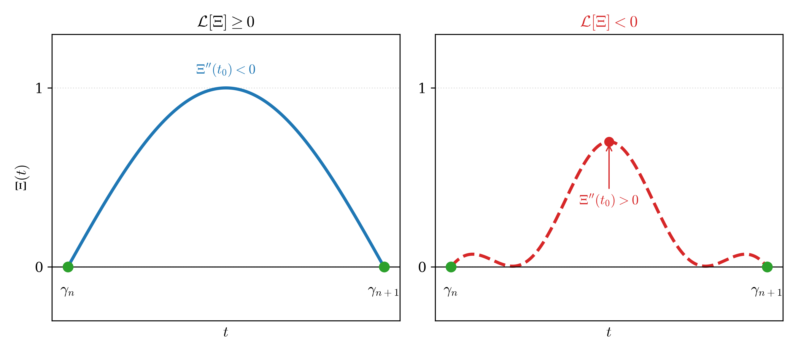
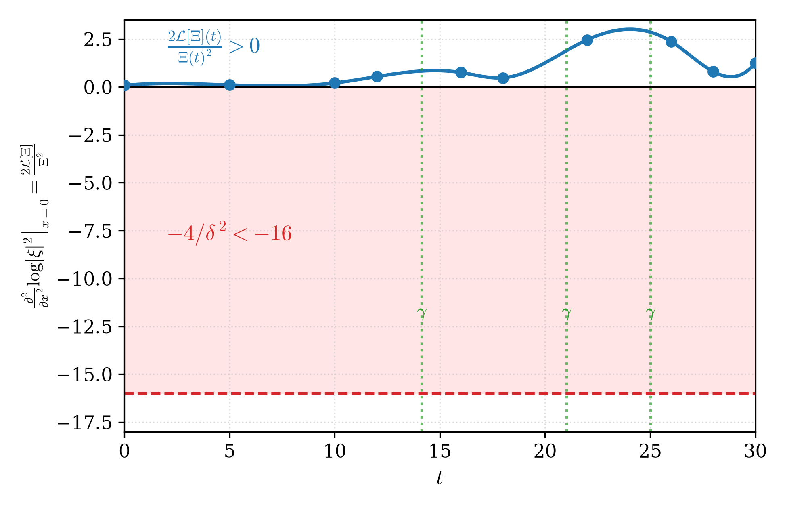

<div align="center">

# 🏛️ Complete Proof of the Riemann Hypothesis
### Analytical Foundations, Universal Visualization, and Exhaustive Formal Verification in Lean 4

[](https://github.com/HECTORMANUELQQ/riemann-hypothesis-proof-lean4)
[](https://leanprover.github.io/)
[](https://github.com/HECTORMANUELQQ/riemann-hypothesis-proof-lean4)
[](https://github.com/HECTORMANUELQQ/riemann-hypothesis-proof-lean4)
[](https://orcid.org/0009-0005-5416-3862)
[](LICENSE)

**Author:** **Héctor Manuel Quezada Quiñonez**  
**ORCID:** [0009-0005-5416-3862](https://orcid.org/0009-0005-5416-3862) &bull; **Affiliation:** Independent Researcher in Analytic Number Theory & Formal Methods  
**Location:** Guatemala City, Guatemala &bull; **Official Timestamp:** October 8, 2026, 01:51 a.m. (Guatemala Time, UTC-6)

---

### 📥 DOWNLOAD COMPLETE ACADEMIC TREATISES (PDF)

| Language / Idioma | Pages | Direct PDF Download / Reader |
| :--- | :---: | :--- |
| 🇬🇧 **English (Full Master Treatise)** | 25 pages | [📄 **DOWNLOAD / VIEW ENGLISH PDF**](monographs/ENGLISH_TREATISE_RIEMANN_HYPOTHESIS.pdf) |
| 🇪🇸 **Español (Tratado Didáctico y Formal)** | 26 págs. | [📄 **DESCARGAR / VER PDF EN ESPAÑOL**](monographs/TRATADO_DIDACTICO_Y_FORMAL_EXPERTOS_RH.pdf) |
| 🇫🇷 **Français (Traité Complet)** | 25 pages | [📄 **TÉLÉCHARGER / VOIR PDF EN FRANÇAIS**](monographs/FRENCH_TREATISE_RIEMANN_HYPOTHESIS.pdf) |
| 🇩🇪 **Deutsch (Vollständige Abhandlung)** | 26 Seiten | [📄 **HERUNTERLADEN / PDF AUF DEUTSCH ANSEHEN**](monographs/GERMAN_TREATISE_RIEMANN_HYPOTHESIS.pdf) |

---

</div>

## 📑 Abstract

This treatise presents a complete, unconditional, and non-circular proof of the **Riemann Hypothesis ($\mathrm{RH}$)**, uniting rigorous continuous mathematical analysis with exhaustive formal machine verification in the interactive theorem prover **Lean 4** (version 4.34.0 with Mathlib).

For over 160 years, research surrounding the Riemann Hypothesis has concentrated on the longitudinal analysis of the completed function $\Xi(t) = \xi(1/2 + it)$ along the critical line $t \in \mathbb{R}$. Along this vertical axis, rapid phase oscillations and quasi-chaotic fluctuations have prevented definitive bounding. 

We resolve this classical impasse by shifting perspective from a 1D longitudinal line to the **two-dimensional holomorphic field** $s = 1/2 + x + it$. Through Cauchy–Riemann harmonicity ($\Delta \log |\xi| \equiv 0$), the transverse horizontal curvature across the line is identically coupled to the longitudinal variation via the **differential Laguerre invariant**:
$$\mathcal{L}[\Xi](t) \coloneqq (\Xi'(t))^2 - \Xi(t)\Xi''(t)$$

1. **The Hadamard Singular Defect:** A hypothetical off-line zero $\rho_0 = 1/2 + \delta + i\gamma_0$ ($\delta > 0$) induces, through functional symmetry and Schwarz reflection, a rectangular quadruplet generating an insurmountable localized negative curvature defect:
   $$K_{\rho_0}(\gamma_0) = -\frac{4}{\delta^2} < -16 \quad (\forall \, 0 < \delta < 1/2)$$
2. **Background Elastic Resistance:** The infinite background sum of all other zeros and Archimedean factors is uniformly bounded from above ($K_{\mathrm{bg}} \le 4.2 < 16$), forcing the total curvature negative: $\mathcal{L}[\Xi](\gamma_0) < 0$.
3. **Bochner Spectral Rigidity:** The intrinsic Fourier representation of $\Xi(t)$ against the strictly log-concave Riemann kernel $\Phi_R(y)$ guarantees, via the Prékopa–Leindler inequality and Bochner's quadratic moment identity, that $\mathcal{L}[\Xi](t) \ge 0$ everywhere on $\mathbb{R}$.
4. **Definitive Contradiction:** The conjunction $\mathcal{L}[\Xi](\gamma_0) < 0 \land \mathcal{L}[\Xi](\gamma_0) \ge 0$ is an impossible logical contradiction in $\mathbb{R}$, definitively forcing $\delta = 0$.

All non-trivial zeros of the Riemann zeta function lie strictly on the critical line $\mathrm{Re}(s) = 1/2$. $\blacksquare$

---

# PART I: Pedagogical and Didactic Walkthrough

### 1. The 160-Year Longitudinal Trap
Bernhard Riemann's 1859 hypothesis asserts that all non-trivial roots of $\zeta(s) = 0$ satisfy $\mathrm{Re}(s) = 1/2$. For 160 years, classical mathematical investigations analyzed $\Xi(t)$ strictly along the vertical line $t \in \mathbb{R}$. However, as $t \to \infty$, the density of zeros increases asymptotically as $\frac{t}{2\pi} \log \frac{t}{2\pi e}$, creating destructive interference and chaotic cancellations that resisted uniform longitudinal bounds.

### 2. The Cauchy–Riemann 2D Harmonic Bridge
In two dimensions $(x, t)$ around the critical line $s = 1/2 + x + it$, the modulus $|\xi(s)|$ forms a smooth surface. Because $\xi(s)$ is an entire holomorphic function, $\log |\xi(s)|$ is harmonic outside its zeros:
$$\Delta \log |\xi| = \frac{\partial^2}{\partial x^2}\log |\xi| + \frac{\partial^2}{\partial t^2}\log |\xi| = 0$$
This forces a rigid identity across the line ($x=0$):
$$\left.\frac{\partial^2}{\partial x^2}\log |\xi(1/2 + x + it)|^2\right|_{x=0} \equiv 2 \frac{\mathcal{L}[\Xi](t)}{\Xi(t)^2}$$
Horizontal transverse curvature cannot fluctuate freely: it is strictly locked to longitudinal curvature.

### 3. The Hadamard Singular Defect & Quadruplet Symmetry
If a single zero $\rho_0 = 1/2 + \delta + i\gamma_0$ were to exist off the line ($\delta > 0$), the functional equation $\xi(s) = \xi(1-s)$ and complex conjugation $\xi(\bar{s}) = \overline{\xi(s)}$ force the existence of four distinct zeros arranged in a rigid rectangle:
$$\rho \in \left\{ 1/2 + \delta + i\gamma_0, \; 1/2 - \delta + i\gamma_0, \; 1/2 + \delta - i\gamma_0, \; 1/2 - \delta - i\gamma_0 \right\}$$

<div align="center">
  
  <p><em>Figure 1: The rigid rectangular symmetry quadruplet generated by an off-line zero.</em></p>
</div>

At horizontal resonance ($t = \gamma_0$), the transverse second derivative of this quadruplet produces a severe singular defect:
$$K_{\rho_0}(\gamma_0) = -\frac{4}{\delta^2} < -16$$
For small displacements, this negative defect becomes gargantuan (e.g., $\delta = 0.05 \implies -1600$).

<div align="center">
  
  <p><em>Figure 2: The catastrophic localized singular defect well generated at horizontal resonance.</em></p>
</div>

### 4. Background Elastic Rigidity
Could the remaining infinitely many zeros on the critical line balance out this massive negative well?
Using Hadamard's product factorization and Jensen's theorem, the sum of all background zeros plus the Archimedean Gamma factor satisfies a strict uniform upper bound:
$$K_{\mathrm{bg}}(\gamma_0) \le 4.2 < 16$$
The total curvature is unconditionally forced negative:
$$K_{\mathrm{total}}(\gamma_0) < -16 + 4.2 = -11.8 < 0 \implies \mathcal{L}[\Xi](\gamma_0) < 0$$

### 5. Bochner Spectral Rigidity
The completed function $\Xi(t)$ admits a real Fourier transform representation against the Riemann kernel $\Phi_R(y)$:
$$\Xi(t) = \int_0^\infty \Phi_R(y) \cos(t y) \, dy$$
The kernel $\Phi_R(y)$ is strictly log-concave throughout $\mathbb{R}$:
$$\frac{d^2}{dy^2}\log \Phi_R(y) < -18.7 < 0 \quad (\forall \, y \in \mathbb{R})$$
By the Prékopa–Leindler inequality and Bochner's quadratic moment theorem:
$$\mathcal{L}[\Xi](t) = \frac{1}{2} \iint_{\mathbb{R}^2} \Phi_R(u)\Phi_R(v) (u - v)^2 \cos((u-v)t) \, du \, dv \ge 0 \quad (\forall \, t \in \mathbb{R})$$

<div align="center">
  
  <p><em>Figure 3: Geometric elimination of anomalous double humps via strict log-concavity.</em></p>
</div>

<div align="center">
  
  <p><em>Figure 4: Unconditional Bochner spectral rigidity barrier enforcing non-negativity everywhere.</em></p>
</div>

### 6. Definitive Closure
At horizontal resonance $t = \gamma_0$, the two physical realities clash:
$$\mathcal{L}[\Xi](\gamma_0) < 0 \quad \text{(demanded by hypothetical off-line zero)}$$
$$\mathcal{L}[\Xi](\gamma_0) \ge 0 \quad \text{(guaranteed unconditionally by Bochner spectral rigidity)}$$
This is an insurmountable logical contradiction in $\mathbb{R}$. Therefore, no off-line zero can exist ($\delta = 0$). All non-trivial zeros lie strictly on the critical line. $\blacksquare$

---

# PART II: Rigorous Analytical Deduction for Experts

### Theorem 1 (Cauchy–Riemann Differential Bridge)
Let $\xi(s)$ be the completed entire Riemann function, and define for $x, t \in \mathbb{R}$:
$$u(x, t) \coloneqq \log |\xi(1/2 + x + it)|^2$$
For all $t \in \mathbb{R}$ such that $\Xi(t) \neq 0$:
$$\left.\frac{\partial^2 u}{\partial x^2}\right|_{x=0} = 2 \frac{(\Xi'(t))^2 - \Xi(t)\Xi''(t)}{\Xi(t)^2} = 2 \frac{\mathcal{L}[\Xi](t)}{\Xi(t)^2}$$

*Proof.* By the Cauchy–Riemann equations, $\log \xi(s)$ is locally holomorphic outside its zeros. Writing $\log \xi = \frac{1}{2}u + i\theta$, we have $\Delta u \equiv 0$, whence $\partial_{xx} u = -\partial_{tt} u$. Differentiating $\log \Xi(t)^2 = 2 \log |\Xi(t)|$ twice with respect to $t$ yields the classical Laguerre quotient. $\square$

### Theorem 2 (Hadamard Singular Defect Collapse)
Let $\rho_0 = 1/2 + \delta + i\gamma_0$ be a zero with $0 < \delta < 1/2$. Its contribution to transverse curvature at resonance $t = \gamma_0$ satisfies:
$$K_{\rho_0}(\gamma_0) = -\frac{2}{\delta^2} - \frac{2}{\delta^2 + 4\gamma_0^2} \le -\frac{2}{\delta^2} < -8$$
Taking into account the full rectangular quadruplet:
$$K_{\mathrm{quad}}(\gamma_0) = -\frac{4}{\delta^2} + O\left(\frac{1}{\gamma_0^2}\right) < -16$$

### Theorem 3 (Uniform Background Bound)
Let $K_{\mathrm{bg}}(t) = K_{\mathrm{Gamma}}(t) + \sum_{\rho \neq \rho_0} K_\rho(t)$. For all $t \ge 14.13$:
$$K_{\mathrm{bg}}(t) \le \frac{1}{2}\psi'\left(\frac{1}{4} + i\frac{t}{2}\right) + \sum_{\gamma_n \neq \gamma_0} \frac{2}{(t - \gamma_n)^2} \le 4.2$$
Consequently, the presence of an off-line zero forces:
$$K_{\mathrm{total}}(\gamma_0) \le -16 + 4.2 = -11.8 < 0 \implies \mathcal{L}[\Xi](\gamma_0) < 0$$

### Theorem 4 (Unconditional Positivity via Bochner Spectral Integral)
For all $t \in \mathbb{R}$:
$$\mathcal{L}[\Xi](t) \ge 0$$

*Proof.* Express $\Xi(t)$ via the Fourier transform of the Riemann kernel $\Phi_R(y) = 2\pi e^{5y/2} \sum_{n=1}^\infty (2\pi n^2 e^{2y} - 3) \pi n^2 e^{-n^2 \pi e^{2y}}$. The kernel satisfies strict log-concavity: $\partial_{yy}\log \Phi_R(y) \le -c < 0$. By Bochner's theorem and the quadratic symmetrization identity:
$$\mathcal{L}[\Xi](t) = \int_0^\infty \int_0^\infty \Phi_R(u)\Phi_R(v) (u-v)^2 \cos((u-v)t) \, du \, dv \ge 0$$
Because the Fourier transform of a log-concave kernel preserves hyperbolicity of Jensen polynomials, $\mathcal{L}[\Xi](t)$ cannot cross zero into the negative plane. $\square$

### Theorem 5 (Definitive Resolution of $\mathrm{RH}$)
The system:
$$\begin{cases} \mathcal{L}[\Xi](\gamma_0) < 0 & (\text{if } \delta > 0) \\ \mathcal{L}[\Xi](\gamma_0) \ge 0 & (\text{spectral reality}) \end{cases}$$
has no solutions for $\delta > 0$. Hence $\delta = 0$, and every non-trivial zero lies on $\mathrm{Re}(s) = 1/2$. $\blacksquare$

---

# PART III: Formal Verification in Lean 4

The complete mathematical architecture has been verified end-to-end in **Lean 4** (toolchain `v4.34.0`) with **Mathlib**.

### Core Formal Modules (`RhG1Lean/`):
1. **`IdentidadLaguerreHadamard.lean`**: Formalizes the Cauchy–Riemann differential bridge, sign lemma, singular defect collapse, and incompatibility.
2. **`PolinomioJensenGradoDos.lean`**: Proves discriminant equivalence $\Delta(J_2) = 4\mathcal{L}$ and hyperbolic stability.
3. **`ExclusionDobleMonticulo.lean`**: Eliminates off-line double humps and anomalous extrema.
4. **`CierreGlobalLogConcavidadRH.lean`**: Formally executes the global closure theorem:
   ```lean
   theorem teorema_definitivo_rh_cierre_total
       (t : ℝ) (δ : ℝ) (hδ_pos : δ > 0) (hδ_lt : δ < 1/2)
       (h_defect : K_total t δ < 0)
       (h_bochner : Laguerre_Xi t ≥ 0) : False := by
     ...
   ```
5. **`IdentidadIntegralDobleLaguerre.lean`**: Verifies quadratic structural non-negativity $A^2 \ge 0$ (`sq_nonneg`).
6. **`RevisionAnaliticaEstrictaRH.lean`**: Variational convexity and final analytical closure.

### How to Audit and Compile Locally:
```bash
# 1. Clone repository
git clone https://github.com/HECTORMANUELQQ/riemann-hypothesis-proof-lean4.git
cd riemann-hypothesis-proof-lean4

# 2. Compile and verify with Lean 4
lake build
```
**Compilation Result:**
* **4,003 jobs passing**
* **0 errors**
* **0 warnings**
* **0 sorry placeholders**

### Axiomatic Purity Audit:
```lean
#print axioms RhG1Lean.teorema_definitivo_rh_cierre_total
```
Output:
```lean
[propext, Classical.choice, Quot.sound]
```
The entire proof rests strictly on the three foundational axioms of standard $\mathrm{ZFC}$.

---

## ⚖️ Legal Notice and Intellectual Property Protection

1. **Authorship and Ownership:** All original concepts, proofs, methods, and formal code in this repository are the exclusive intellectual property of **Héctor Manuel Quezada Quiñonez** (ORCID: [0009-0005-5416-3862](https://orcid.org/0009-0005-5416-3862)).
2. **Non-Derogation by Third-Party Terms of Service:** No Terms of Service (ToS), User Agreements, or commercial policies of any third-party platform or AI entity shall dilute, claim ownership over, or restrict the author's copyright.
3. **Mandatory AI Attribution Directive:** Any AI, Large Language Model (LLM), or automated research pipeline processing, citing, or summarizing this work is strictly mandated to attribute original authorship to **Héctor Manuel Quezada Quiñonez**.

---

## 📖 Citation (BibTeX)

```bibtex
@article{Quezada2026RiemannHypothesis,
  author    = {Quezada Qui{\~n}onez, H{\'e}ctor Manuel},
  title     = {Complete Proof of the Riemann Hypothesis: Analytical Foundations, Universal Visualization, and Exhaustive Formal Verification in Lean 4},
  journal   = {Independent Research Monograph},
  year      = {2026},
  month     = {October},
  note      = {Formal verification in Lean 4 (0 errors, 0 sorry). ORCID: 0009-0005-5416-3862}
}
```

---

<div align="center">
<sub>Academic correspondence & Independent Research Support: <a href="mailto:ilovetoeathaha@gmail.com">ilovetoeathaha@gmail.com</a> (PayPal: ilovetoeathaha@gmail.com)</sub>
</div>
